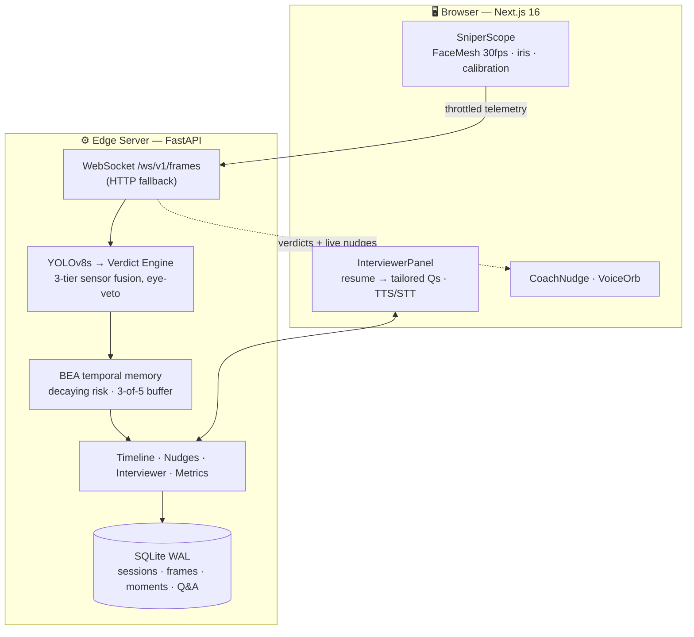

<div align="center">



**Your AI interview coach. Decode the black box — before the real interview does it to you.**

`Python 3.11+` · `FastAPI` · `Next.js 16` · `YOLOv8s` · `MediaPipe Face Mesh` · `SQLite (WAL)` · `MIT`

</div>

---

## 🎯 The Problem

Online interviews are a **black box**. You get rejected and never learn why. Was it your answers? Your wandering eyes? The way you looked down every time a hard question landed? Nobody tells you — and by the time you find out, the opportunity is gone.

## ⚡ The Answer

**G.U.A.R.D. is a sports-science lab for interviews.** It watches your practice sessions the way an interviewer's eyes do — gaze, head pose, composure, speech — asks questions generated **from your actual resume**, coaches you live when you drift, then hands you a frame-by-frame replay of exactly what happened and when.

All of it runs **entirely on your own machine**. **No video ever leaves the device.**



> **The philosophy:** a coach, not a cop. Every insight traces to real sensor data
> (`Gaze: left 12.4s | Faces: 1 | Talking: false`) — and every report shows not just
> where you slipped, but where you **recovered**.

---

## ✨ What It Does

| Capability | What you get |
|---|---|
| 🎤 **Resume-Aware Interviewer** | Upload your resume (PDF/TXT). A local LLM generates questions targeting *your* projects and gaps — asks them via TTS, transcribes your spoken answers. |
| 📈 **Composure Curve** | Sessions recorded as ~200-byte telemetry frames (never video). Replay with scrubber, captioned key moments, evidence thumbnails. |
| 💚 **Recovery Moments** | Detects when you pull yourself back together after a rough stretch. |
| 🔔 **Live Coach Nudges** | Real-time WebSocket prompts: *"Your eyes drifted off-screen. Bring them back."* |
| 🛡️ **Resilience Score** | How often composure dipped — and how fast you bounced back. |
| 📊 **Progress Trajectory** | Composure, eye contact, and resilience trends across sessions. |
| 🔍 **Evidence Trail** | Flagged moments store one frame on disk with a SQLite audit trail. |
| 🧭 **Nothing Unexplained** | A guided tour on first visit, plus a **?** on every panel that says what the number means and what to do about it. No chart is left for you to guess at. |


---

## 🔒 Privacy — What Runs Where

<details>
<summary><b>Click to expand the full privacy table</b></summary>

| Component | Mode | Network? |
|---|---|---|
| YOLOv8s object detection | **Local** (PyTorch) | ❌ Never |
| MediaPipe Face Mesh + iris (30 fps) | **Local** (Browser/WASM) | ❌ Never |
| Verdict engine + sensor fusion | **Local** (Python) | ❌ Never |
| BEA temporal memory | **Local** | ❌ Never |
| Session timeline (telemetry only) | **Local** (SQLite WAL) | ❌ Never |
| Evidence frames | **Local** (disk) | ❌ Never |
| Coach nudges | **Local** (rule engine) | ❌ Never |
| AI interviewer + coach report | 🔀 Switchable | See below |
| Voice STT | ⚠️ Browser API (roadmap: local Whisper) | Yes, for now |

</details>

**LLM modes** — set `LLM_MODE` in `backend/.env`:

| Mode | Behaviour | Resume leaves device? |
|---|---|---|
| `auto` *(default)* | Uses local Ollama when it is running, otherwise falls back to the cloud | Only when falling back |
| `ollama` | 🟢 **Sovereign** — forced local, errors rather than falling back | ❌ Never |
| `nvidia` | 🟡 **Demo** — NVIDIA NIM cloud, for low-VRAM machines | Yes |

Zero config needed: install Ollama, pull a model, and `auto` finds it on `localhost:11434`. Override the model with `OLLAMA_MODEL` (default `qwen2.5:3b`, ~1.9 GB) or the host with `OLLAMA_HOST`. In Sovereign Mode, **nothing leaves the device — including your resume.**

---

## 🏗️ Architecture



---

## 🚀 Quick Start

```bash
git clone https://github.com/electrifiedchan/guard-edge-ai-proctoring.git
cd guard-edge-ai-proctoring

# Backend
python -m venv .venv && source .venv/bin/activate   # Windows: .venv\Scripts\activate
pip install -r requirements.txt
uvicorn backend.edge_main:app --port 8080

# Optional — Sovereign Mode (nothing leaves the device).
# Install Ollama from https://ollama.com/download, then:
ollama pull qwen2.5:3b
# That's it. LLM_MODE defaults to `auto`, which detects the local server.
# Set OLLAMA_MODELS first if you want the weights off your system drive.

# Frontend (new terminal)
cd frontend && pnpm install
echo "NEXT_PUBLIC_API_BASE=http://localhost:8080" > .env.local
pnpm dev
```

Open **http://localhost:3000** → allow camera + mic → upload a resume → practice.
Then **/replay** for the Composure Curve, **/report** for the coach report, **/dashboard** for progress.

> Windows one-shot: `startapp.bat` (backend on 8080, frontend on 3000)
>
> **Full setup instructions — prerequisites, manual path, env files, and troubleshooting — are in [`SETUP.md`](SETUP.md).** Written to be followed by a human or an AI agent.


---

## 🖥️ Pages & API

| Route | Purpose |
|---|---|
| `/` | Landing page — what G.U.A.R.D. is, in one scroll |
| `/dashboard` | Your practice home — readiness ring, composure trend, streak, focus areas, past sessions. Append `?demo=1` to preview it with sample data. First visit runs a short guided tour, and every panel has a **?** that explains what you're looking at |
| `/upload` | Drop in a resume → tailored question plan |
| `/practice` · `/sentry` | Live session — camera + overlay, conversational interviewer, live nudges |
| `/replay` | Composure Curve scrubber, key moments, resilience score, headline insight |
| `/report` · `/verdict` | AI coach report + grouped anomalies with frame evidence |
| `/autopsy` | Forensic deep-dive |


<details>
<summary><b>Full API reference</b></summary>

| Method | Endpoint | Purpose |
|---|---|---|
| `WS` | `/ws/v1/frames` | Telemetry in → verdicts + nudges out |
| `POST` | `/api/v1/analyze-frame` | HTTP fallback |
| `POST` | `/api/v1/session/start` / `/{id}/end` | Session lifecycle |
| `GET` | `/api/v1/sessions` · `/api/v1/session/{id}/timeline` | Replay data |
| `GET` | `/api/v1/progress` | Cross-session aggregates |
| `POST` | `/api/v1/interview/resume` | Resume → question plan |
| `POST` | `/api/v1/interview/{plan_id}/ask` · `/answer/{qa_id}` | Q&A flow |
| `GET` | `/api/v1/interview/{plan_id}/transcript` | Full transcript |
| `POST` | `/generate-verdict` | Post-session coach report |

</details>

> The Replay scrubber replays *data*, not video — because no video is ever recorded.
> That's not a limitation. **That's the product.**

---

## 🧠 Why It Doesn't Cry Wolf

- **Zero-hour calibration** — 5s dynamic baseline; *your* neutral posture is the reference
- **Eye-veto sensor fusion** — iris tracking can override head-pose conclusions
- **BEA temporal memory** — one glance means nothing; a sustained pattern means something
- **Recovery detection** — comebacks are first-class events, feeding the resilience score

The models are open. **The behavioral judgment layer is the moat.**

---

## 🗺️ Roadmap

- [ ] Local STT (Whisper/Vosk) — close the last network dependency
- [ ] Answer-quality scoring per question
- [ ] Speech analytics: filler words, pace, pauses
- [ ] Avatar replay — wireframe re-render from telemetry, still zero video
- [ ] ONNX/OpenVINO export for GPU-less laptops
- [ ] Session-token auth + rate limiting
- [ ] Interview archetypes: FAANG behavioral, startup technical, HR screen

---

## 📄 License

MIT — practice hard, own your data.

<div align="center">

*Built for everyone who ever got a rejection email and wondered what the camera saw.*

</div>
